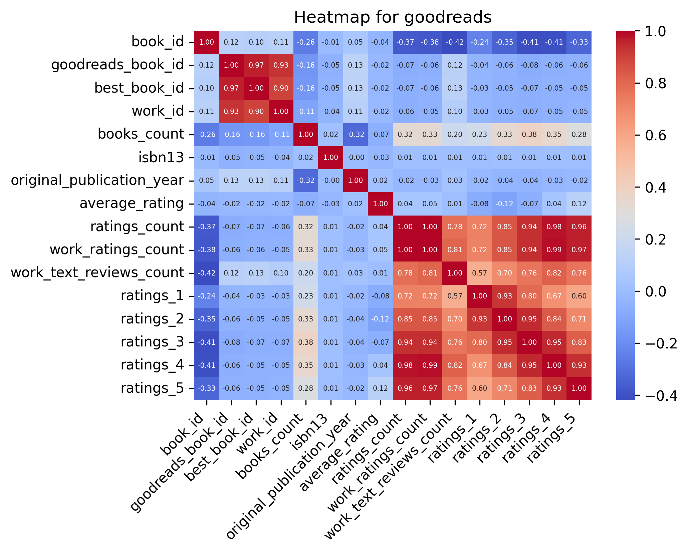
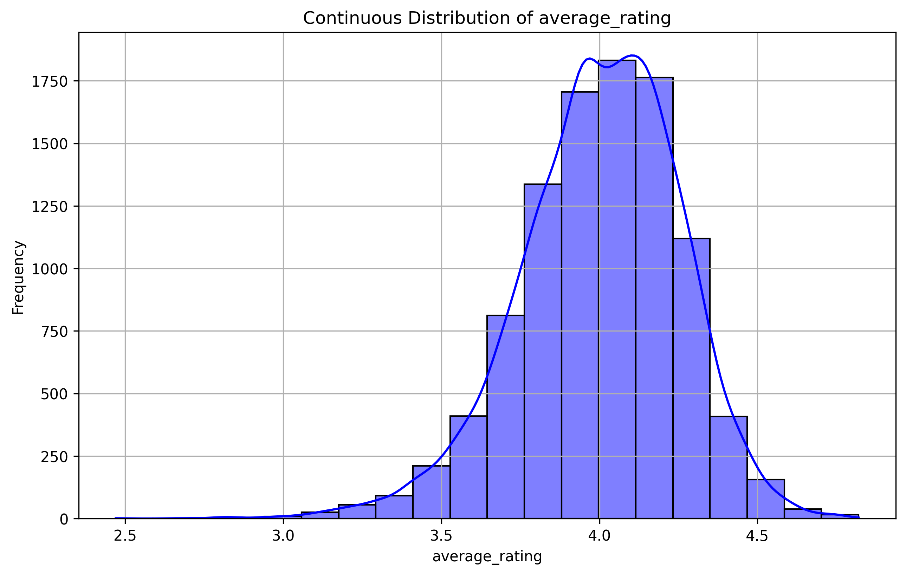
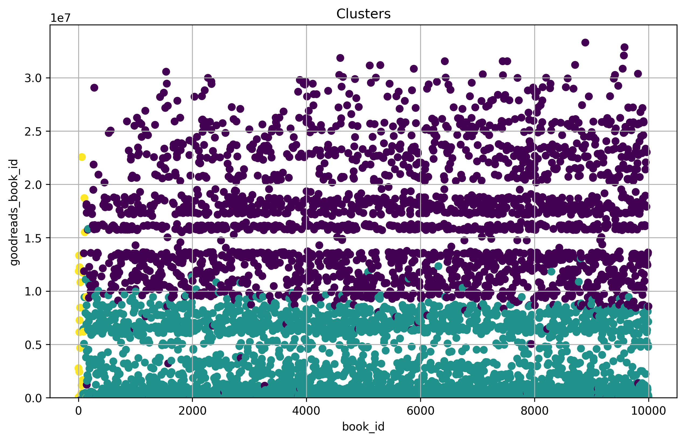

# 'goodreads.csv' Dataset Analysis

## Overview

The dataset used in this analysis is the **goodreads**, which contains data on various attributes related to goodreads. The primary goal of this analysis is to explore the relationships between different features, identify patterns in the data, and provide visualizations that illustrate the distribution of key variables.

The dataset includes information such as **book_id, goodreads_book_id, best_book_id, work_id, books_count**, which are crucial for understanding trends and making data-driven decisions. This report highlights key statistical metrics and visual representations of the dataset, including distributions, correlations, and clustering results.

This analysis will also provide insights into missing data, trends in the numerical and categorical features, and how different attributes relate to each other.

## Summary Statistics
- Number of Columns: 24
- Number of Rows: 10000
- Number of Missing values in different Columns: 
   - isbn: 700
   - isbn13: 585
   - original_publication_year: 21
   - original_title: 585
   - language_code: 1084
## Narrative of dataset: 
The dataset under analysis comprises 10,000 entries across 24 columns, primarily containing metadata about books from a reading platform. The numerical columns reveal intriguing patterns: while integer IDs, such as `book_id` and `goodreads_book_id`, showcase a well-distributed range, the `isbn13` column is notably represented as a float64 type, indicating potential parsing issues that might obscure its integrity. The `books_count` stands out with a striking maximum of 3,455, suggesting a diverse collection of works within the dataset.

Upon reviewing the statistical summary, we observe that the average ratings hover around 4.00 with a reasonable standard deviation of approximately 0.25, indicating consistent user satisfaction across most books. However, anomalies in the `original_publication_year`—spanning from -1750 to 2017—hint at data accuracy issues that could skew year-based analyses.

Missing data is another critical aspect, with a total of 700 missing `isbn` entries and 585 missing `original_title`. This significant absence can hinder any comprehensive textual or bibliographic analysis, emphasizing the need for careful data imputation or adaptation strategies to ensure robust findings.

Clustering outcomes reveal interesting dynamics among various attributes. For instance, the KMeans centers suggest that higher ratings correlate well with increased counts of reviews, particularly with the highest rating counts aligned closely with four and five-star ratings. Such relationships uncover the likelihood of user engagement and may serve as a predictor for future ratings.

The correlation analysis further enhances our understanding of relationships between features. Notably, the strongest correlations exist between rating counts and specific ratings (e.g., `ratings_4` and `ratings_5`), suggesting that overall user approval strongly influences the volume of reviews. Conversely, features like `average_rating` show weaker correlations with publication year and other identifiers, indicating their independence from temporal factors.

In summation, the dataset’s size and structure provide a rich canvas for analysis, yet caution is warranted given the anomalies and missing data. The insights gleaned from clustering and correlations reveal patterns of engagement and satisfaction, which are critical for potential recommendations or algorithm design. Addressing the missing values could unlock further insights and enhance the dataset's reliability for deeper analyses.

## Visualisations:
### Correlation Heatmap for the Numerical Data:
A correlation heatmap was generated to visualize the relationships between numerical features in the dataset.

### Distribution for 'average_rating' Column of Dataset: 

### Kmeans cluster for Dataset:
The KMeans clustering plot above shows the segmentation of the dataset into 3 clusters, based on the selected features: book_id, goodreads_book_id. Each cluster, represented by a distinct color, groups similar data points together, highlighting underlying patterns in the dataset. The centroids of the clusters, located at the mean of the points, provide insight into the central tendencies of the data for each cluster.

