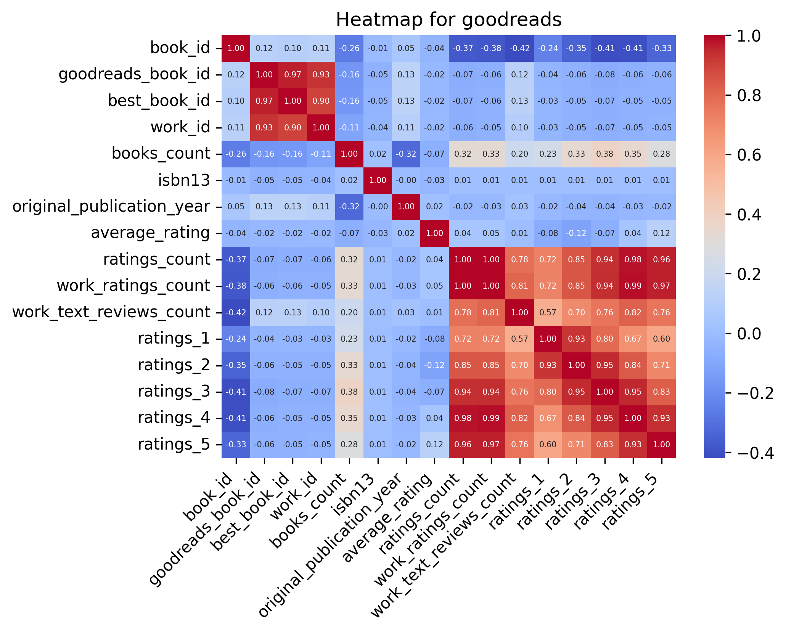
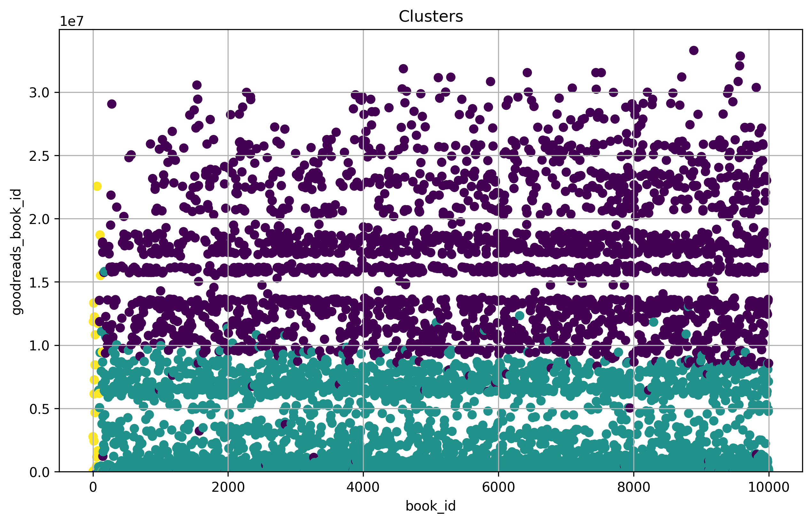

# 'goodreads' Dataset Analysis

## Overview

The dataset used in this analysis is the **Cgoodreads**, which contains data on various attributes related to goodreads. The primary goal of this analysis is to explore the relationships between different features, identify patterns in the data, and provide visualizations that illustrate the distribution of key variables.

The dataset includes information such as **book_id, goodreads_book_id, best_book_id, work_id, books_count**, which are crucial for understanding trends and making data-driven decisions. This report highlights key statistical metrics and visual representations of the dataset, including distributions, correlations, and clustering results.

This analysis will also provide insights into missing data, trends in the numerical and categorical features, and how different attributes relate to each other.
## Summary Statistics
- Number of Columns: 24
- Number of Rows: 10000
- Number of Missing values in different Columns: 
   - isbn: 700
   - isbn13: 585
   - original_publication_year: 21
   - original_title: 585
   - language_code: 1084

## Narrative of dataset: 
In analyzing this extensive dataset of 10,000 entries, we observe a diverse range of columns representing various characteristics of books. Notably, the dataset includes both numerical data types (e.g., integers for IDs and counts, floats for ratings and publication years) and categorical data types (e.g., authors and language codes). This mixture indicates a robust multifaceted approach to understanding book metrics, making it suitable for various analytical pursuits.

### Key Patterns and Anomalies

The **statistical summary** reveals some intriguing patterns: while the average book rating hovers around 4.00 (with a standard deviation of approximately 0.25), there's notable variability in ratings counts that spans from a mere 2,716 to over 4.7 million. This disparity suggests that a select few books dominate the ratings landscape, potentially influencing overall averages. Moreover, the **books_count** statistic, with a maximum of 3,455, indicates a few highly productive authors, emphasizing that some writers have numerous published works compared to their peers.

### Significance of Missing Data

Highlighting the **missing values**, we find several critical columns affected, such as `isbn` (700 missing), `isbn13` (585 missing), and notably, `original_title` (585 missing). These gaps may hinder certain analyses, like assessing the impact of a book's title on its ratings or understanding its publication history. The impact extends beyond mere data integrity; missing entries in key identifiers could lead to skewed insights, particularly in genre or author-based analyses, and may bias clustering outcomes.

### Insights from Clustering and Correlation

Diving into the **clustering** analysis yields insights into how books group together, highlighting three distinct clusters. The cluster centers indicate significant divergence, particularly in measures such as `ratings_count`, suggesting that certain books exhibit heightened popularity or appeal. 

Additionally, the **correlation heatmap** unveils strong relationships between ratings categories; as ratings for one star category increase, so do the ratings in adjacent categories (the positive correlations between ratings_4 and ratings_5, for instance). Conversely, the negative correlations between some ratings and counts signal a nuanced understanding of user feedback, emphasizing that an increase in one set may correspond with a decrease in perceived quality.

### Observations on Dataset's Size and Structure

The dataset's shape (10,000 rows and 24 columns) paints a picture of a comprehensive collection of book data, sufficient for meaningful quantitative analysis yet compact enough to allow for swift manipulation and exploration. The diversity in columns ensures a rich landscape for insights�ranging from author influence on ratings to trends in publication years�making it a valuable resource for any data scientist interested in the literary space. 

In summary, while certain anomalies and missing values present challenges, the dataset is structurally sound and ready for in-depth analysis. The relationships unveiled through correlation and clustering open doors to exploring intricate dynamics within the book community, making it a compelling study in literary data science.
## Visualisations:
### Correlation Heatmap for the Numerical Data:
A correlation heatmap was generated to visualize the relationships between numerical features in the dataset.

### Distribution for 'average_rating' Column of Dataset: 

### Kmeans cluster for Dataset:
The KMeans clustering plot above shows the segmentation of the dataset into 3 clusters, based on the selected features: book_id, goodreads_book_id. Each cluster, represented by a distinct color, groups similar data points together, highlighting underlying patterns in the dataset. The centroids of the clusters, located at the mean of the points, provide insight into the central tendencies of the data for each cluster.

## Conclusion

In this analysis, we explored the dataset to uncover patterns and relationships between its attributes. Here are some key takeaways:
1. The correlation heatmap revealed significant relationships between the numerical features, helping us identify potential areas for deeper analysis.
2. The histogram analysis showed the distribution of data for the selected column, providing insights into its nature (whether it's discrete or continuous).
3. The pie chart visualized the distribution of categorical values, making it easier to understand the prevalence of different categories.
4. K-means clustering helped group similar data points, uncovering potential segments within the dataset.

Overall, this analysis serves as a foundation for further exploration, predictive modeling, and decision-making.
