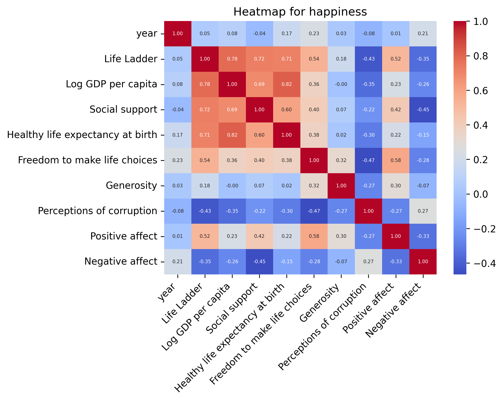
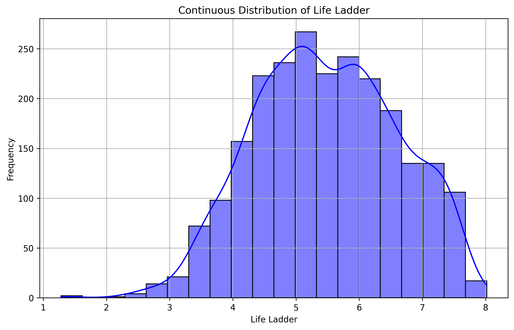
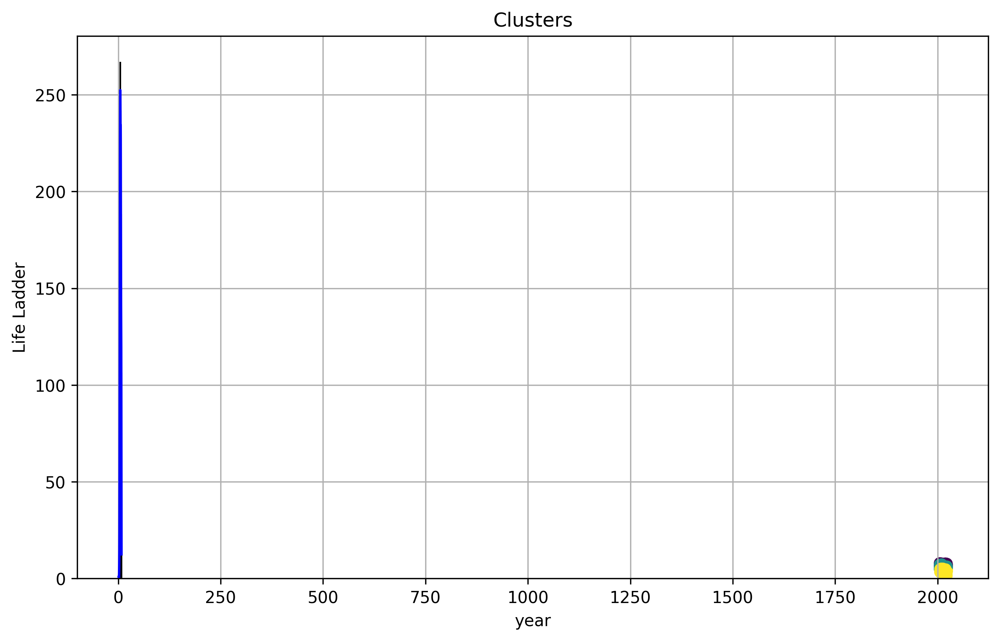

# 'happiness.csv' Dataset Analysis

## Overview

The dataset used in this analysis is the **happiness**, which contains data on various attributes related to happiness. The primary goal of this analysis is to explore the relationships between different features, identify patterns in the data, and provide visualizations that illustrate the distribution of key variables.

The dataset includes information such as **Country name, year, Life Ladder, Log GDP per capita, Social support**, which are crucial for understanding trends and making data-driven decisions. This report highlights key statistical metrics and visual representations of the dataset, including distributions, correlations, and clustering results.

This analysis will also provide insights into missing data, trends in the numerical and categorical features, and how different attributes relate to each other.

## Summary Statistics
- Number of Columns: 12
- Number of Rows: 2363
- Number of Missing values in different Columns: 
   - Log GDP per capita: 28
   - Social support: 13
   - Healthy life expectancy at birth: 63
   - Freedom to make life choices: 36
   - Generosity: 81
   - Perceptions of corruption: 125
   - Positive affect: 24
   - Negative affect: 16
## Narrative of dataset: 
As we delve into this diverse dataset encompassing various socio-economic indicators across countries and years, interesting patterns and notable anomalies emerge. With a total of 2,363 rows and 12 columns, the dataset showcases a mix of numerical data types, primarily `float64` and `int64`. Each entry represents crucial aspects related to life quality and economic conditions, such as the 'Life Ladder,' 'Log GDP per capita,' and 'Healthy life expectancy at birth.'

A statistical summary reveals some intriguing statistics. For instance, the 'Life Ladder' scores range from 1.281 to 8.019, indicating substantial differences in perceived quality of life across nations. However, we observe substantial missing data, particularly in 'Log GDP per capita' (28 entries missing), 'Healthy life expectancy at birth' (63 missing), and 'Generosity' (81 missing). This missing data warrants caution, as it may skew analyses and interpretations, particularly if the missingness is not random. Potential biases could arise if the absence of values correlates with geographical, economic, or social factors.

The application of KMeans clustering reveals three distinct clusters characterized by variations in the key indicators. For example, the first cluster exhibits higher values across most indicators, suggesting a correlation with overall well-being and economic prosperity. Conversely, the second cluster shows moderate levels, while the third features significantly lower values. These findings might reflect differing developmental stages among countries, guiding policymakers in targeted interventions.

Correlational analysis reinforces these insights, showing strong interdependencies between the 'Life Ladder' and 'Log GDP per capita' (0.78), as well as 'Social support' (0.72). Notably, there is a negative correlation between 'Life Ladder' and 'Perceptions of corruption' (-0.43), underscoring a potential link between societal well-being and perceived governmental integrity. Furthermore, the positive correlation between 'Freedom to make life choices' and 'Positive affect' reinforces the notion that autonomy plays a critical role in life satisfaction.

In summary, while the dataset provides a rich tapestry of information, the presence of missing values and the intricacies within the correlations and clusters underscore the complexity of analyzing social and economic indicators. These insights pave the way for data-driven policies aimed at fostering well-being and addressing disparities among countries.

## Visualisations:
### Correlation Heatmap for the Numerical Data:
A correlation heatmap was generated to visualize the relationships between numerical features in the dataset.

### Distribution for 'Life Ladder' Column of Dataset: 

### Kmeans cluster for Dataset:
The KMeans clustering plot above shows the segmentation of the dataset into 3 clusters, based on the selected features: year, Life Ladder. Each cluster, represented by a distinct color, groups similar data points together, highlighting underlying patterns in the dataset. The centroids of the clusters, located at the mean of the points, provide insight into the central tendencies of the data for each cluster.

