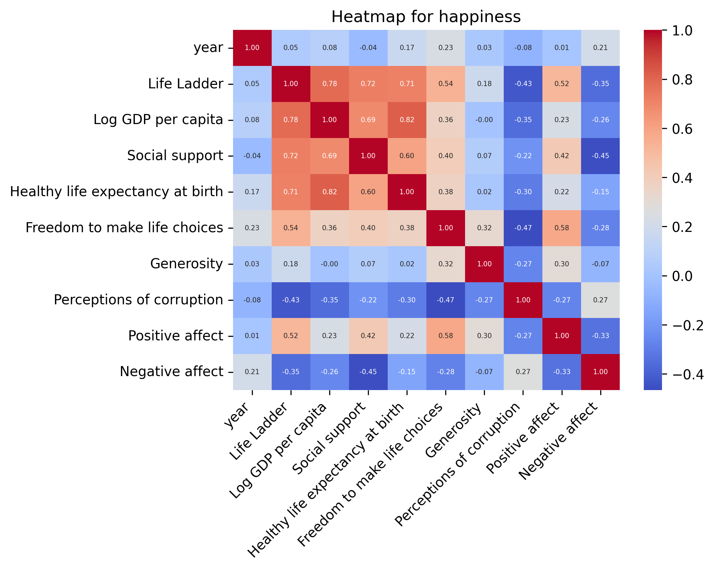
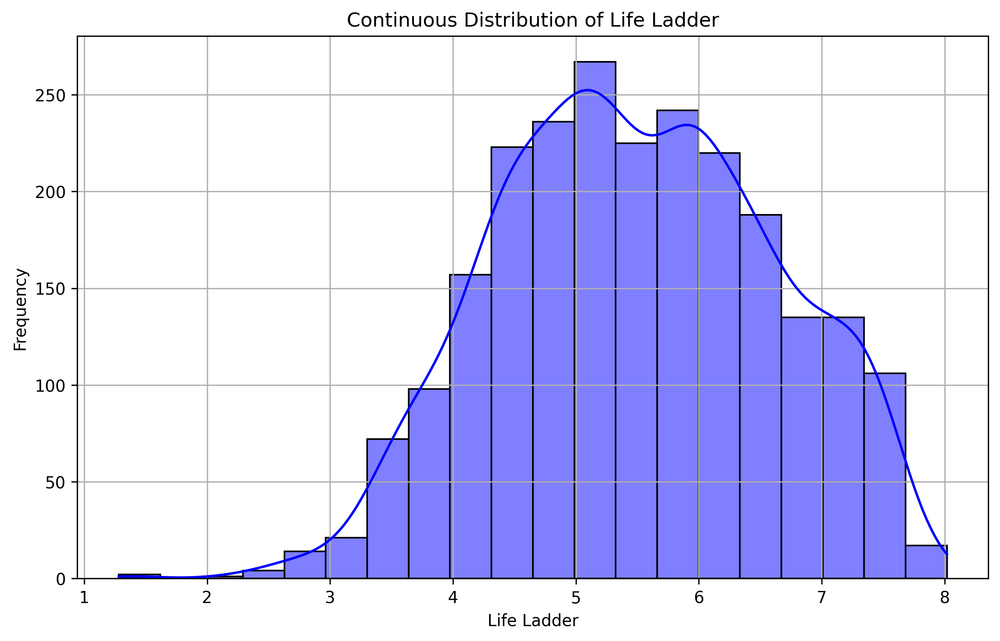
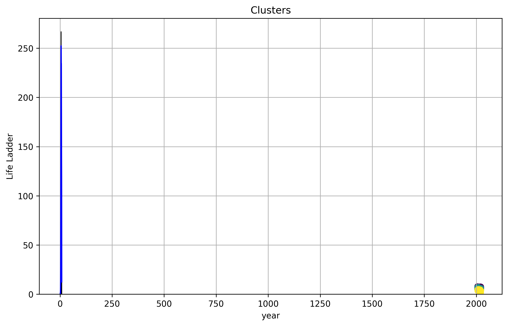

# 'happiness.csv' Dataset Analysis

## Overview

The dataset used in this analysis is the **happiness**, which contains data on various attributes related to happiness. The primary goal of this analysis is to explore the relationships between different features, identify patterns in the data, and provide visualizations that illustrate the distribution of key variables.

The dataset includes information such as **Country name, year, Life Ladder, Log GDP per capita, Social support**, which are crucial for understanding trends and making data-driven decisions. This report highlights key statistical metrics and visual representations of the dataset, including distributions, correlations, and clustering results.

This analysis will also provide insights into missing data, trends in the numerical and categorical features, and how different attributes relate to each other.
## Summary Statistics
- Number of Columns: 12
- Number of Rows: 2363
- Number of Missing values in different Columns: 
   - Log GDP per capita: 28
   - Social support: 13
   - Healthy life expectancy at birth: 63
   - Freedom to make life choices: 36
   - Generosity: 81
   - Perceptions of corruption: 125
   - Positive affect: 24
   - Negative affect: 16

## Narrative of dataset: 
In analyzing the dataset focused on various global metrics such as life satisfaction, economic prosperity, and social wellbeing, it's essential to recognize not only the data types and statistics but also the potential implications of missing values, as well as insights derived from clustering and correlation analysis.

### Key Patterns and Anomalies:
The dataset comprises 12 columns that are a mix of categorical (e.g., 'Country name') and numerical features representing values such as 'Life Ladder', 'Log GDP per capita', and 'Healthy life expectancy at birth'. Most columns contain float and integer data types, indicating a quantitative measurement of wellbeing and economic factors across different countries over several years. 

The statistical summary reveals notable variations, particularly in 'Life Ladder', which has a mean around 5.48 with a standard deviation of 1.13, suggesting a diverse range of life satisfaction levels globally. Conversely, 'Generosity' appears notably low, with a mean near zero, indicating that few respondents rated their generosity highly, hinting at the complex social dynamics of different countries.

### Impact of Missing Data:
The analysis uncovers a significant amount of missing data across several columns. For instance, 'Log GDP per capita' has 28 missing entries, while 'Generosity' suffers from 81 missing entries. This missingness can introduce bias and limit the generalizability of any findings drawn from this dataset. Particularly, substantial gaps in key metrics may distort comparative analyses between countries, as some regions could be underrepresented, thereby skewing results.

### Insights from Clustering and Correlation Analysis:
KMeans clustering highlights three distinct groups across various dimensions, offering a glimpse into how different countries may cluster based on socio-economic attributes. The cluster centers suggest that certain countries exhibit higher levels of life satisfaction, those with better economic resources and social support systems.

The correlation analysis further intensifies these insights, revealing strong associations between 'Life Ladder' and both 'Log GDP per capita' (0.78) and 'Social support' (0.72). Such correlations signal that higher GDP and social connectedness correlate positively with reported life satisfaction. Conversely, a moderate negative correlation exists between 'Life Ladder' and 'Perceptions of corruption' (-0.43), suggesting that countries perceived as less corrupt tend to rate higher in life satisfaction.

### Observations about Dataset Structure:
With a total of 2363 entries, the dataset appears robust, yet the presence of missing values and the fluctuation in entry counts across columns (notably in socioeconomic indicators) warrants careful analysis. The dataset�s structure allows for a comprehensive exploration of how various factors intersect, yet the gaps must be strategically addressed to glean actionable insights. Overall, this dataset offers a fertile ground for understanding global wellbeing, though attention to missing data will be crucial in ensuring integrity and reliability in findings.
## Visualisations:
### Correlation Heatmap for the Numerical Data:
A correlation heatmap was generated to visualize the relationships between numerical features in the dataset.

### Distribution for 'Life Ladder' Column of Dataset: 

### Kmeans cluster for Dataset:
The KMeans clustering plot above shows the segmentation of the dataset into 3 clusters, based on the selected features: year, Life Ladder. Each cluster, represented by a distinct color, groups similar data points together, highlighting underlying patterns in the dataset. The centroids of the clusters, located at the mean of the points, provide insight into the central tendencies of the data for each cluster.

## Conclusion

In this analysis, we explored the dataset to uncover patterns and relationships between its attributes. Here are some key takeaways:
1. The correlation heatmap revealed significant relationships between the numerical features, helping us identify potential areas for deeper analysis.
2. The histogram analysis showed the distribution of data for the selected column, providing insights into its nature (whether it's discrete or continuous).
3. The pie chart visualized the distribution of categorical values, making it easier to understand the prevalence of different categories.
4. K-means clustering helped group similar data points, uncovering potential segments within the dataset.

Overall, this analysis serves as a foundation for further exploration, predictive modeling, and decision-making.
