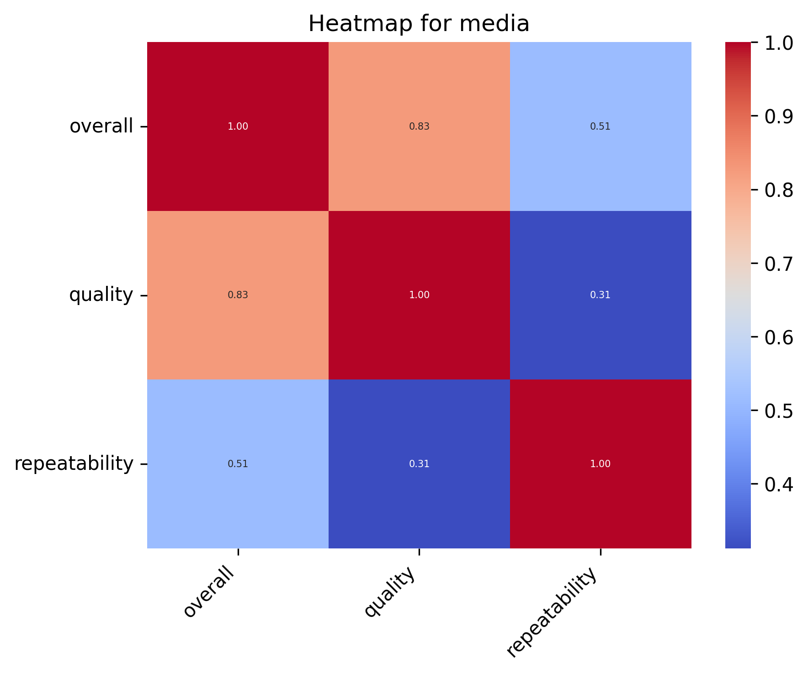
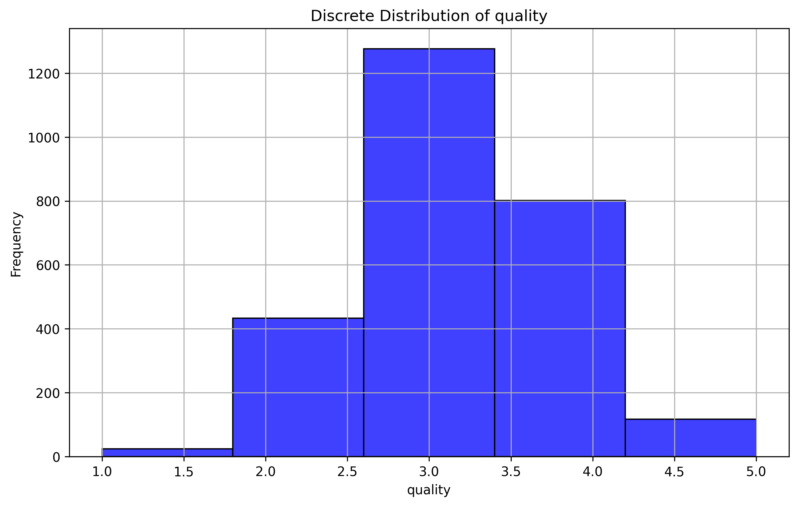
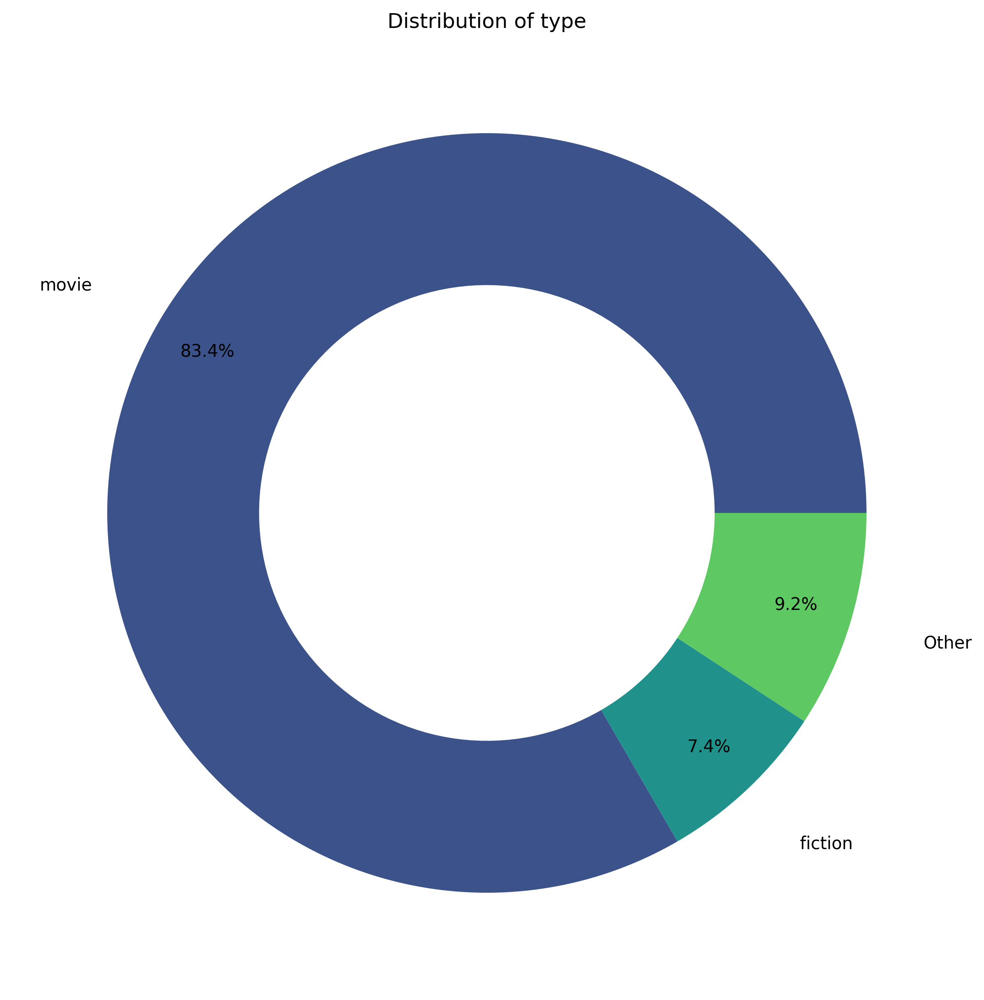

# 'media.csv' Dataset Analysis

## Overview

The dataset used in this analysis is the **media**, which contains data on various attributes related to media. The primary goal of this analysis is to explore the relationships between different features, identify patterns in the data, and provide visualizations that illustrate the distribution of key variables.

The dataset includes information such as **date, language, type, title, by**, which are crucial for understanding trends and making data-driven decisions. This report highlights key statistical metrics and visual representations of the dataset, including distributions, correlations, and clustering results.

This analysis will also provide insights into missing data, trends in the numerical and categorical features, and how different attributes relate to each other.

## Summary Statistics
- Number of Columns: 9
- Number of Rows: 2652
- Number of Missing values in different Columns: 
   - date: 99
   - by: 262
## Narrative of dataset: 
In analyzing the dataset, a rich tapestry of insights emerges from its structure and statistical properties.

### Key Patterns and Observations
The dataset consists of 2652 entries with various attributes, primarily categorized into objects (character strings) and integers, capturing aspects like date, language, type, title, contributor, and three numerical metrics—overall, quality, and repeatability. Notably, the overall scores hover around a mean of 3.05, while the quality scores slightly exceed this at around 3.21. Both metrics show minimal variance with a standard deviation under one, suggesting a concentration of responses around the central values. The repeatability score, on the other hand, has a lower mean of 1.49 and a broader distribution, indicating less consistency in responses.

### Missing Data Implications
However, the dataset is not without its challenges—99 missing values in the ‘date’ column and a staggering 262 for the ‘by’ contributor column could skew results and affect the integrity of any analyses derived from it. These omissions must be addressed, possibly through imputation or exclusion, to prevent them from undermining the insights drawn from the remaining data.

### Clustering and Correlation Insights
The KMeans clustering analysis revealed three distinct centers for overall and quality scores, aligning with the preceding statistics. This clustering advocates that there are significant groups with different levels of satisfaction or evaluation within the dataset. The correlation heatmap further emphasizes strong positive relationships, notably between overall and quality scores (0.83), suggesting a reliable consistency in how items are rated across these dimensions. In contrast, repeatability shows a moderate correlation (0.51) with overall scores, hinting that while repeatability influences overall impressions, it is not overwhelmingly determinant.

### Dataset Size and Structure Observations
With a dataset of 2652 rows and 9 columns, the dimensions are substantial enough to support robust statistical analyses and reveal meaningful patterns. The mix of qualitative and quantitative data positions this dataset as a well-rounded resource for exploration.

In summary, the dataset offers a rich narrative about user ratings, with meaningful insights into its structure, potential pitfalls due to missing data, and the strong interdependencies among key metrics that suggest a nuanced understanding of quality and repeatability affects overall evaluations.

## Visualisations:
### Correlation Heatmap for the Numerical Data:
A correlation heatmap was generated to visualize the relationships between numerical features in the dataset.

### Distribution for 'quality' Column of Dataset: 

### Pie-Chart for 'type' Column of Dataset: 

