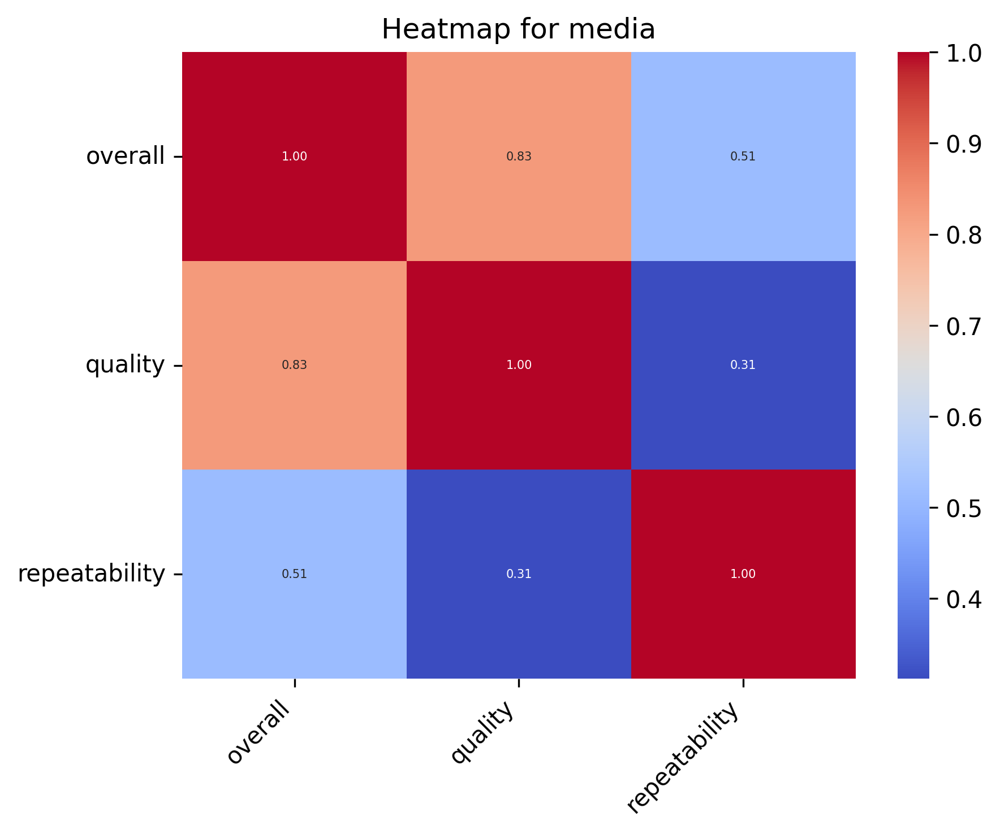
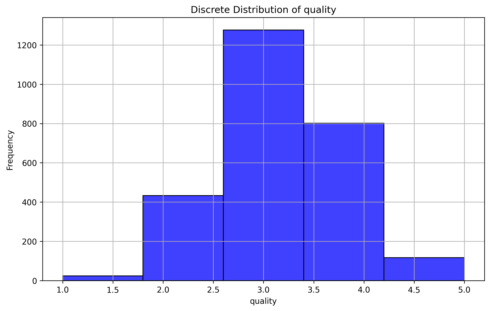
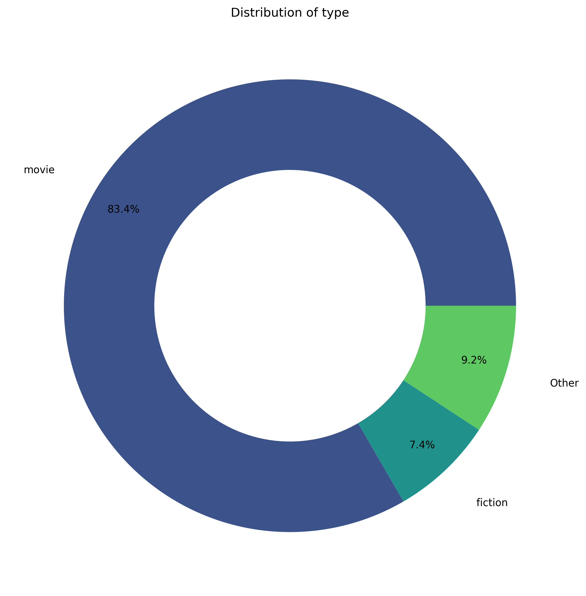

# 'media.csv' Dataset Analysis

## Overview

The dataset used in this analysis is the **media**, which contains data on various attributes related to media. The primary goal of this analysis is to explore the relationships between different features, identify patterns in the data, and provide visualizations that illustrate the distribution of key variables.

The dataset includes information such as **date, language, type, title, by**, which are crucial for understanding trends and making data-driven decisions. This report highlights key statistical metrics and visual representations of the dataset, including distributions, correlations, and clustering results.

This analysis will also provide insights into missing data, trends in the numerical and categorical features, and how different attributes relate to each other.
## Summary Statistics
- Number of Columns: 9
- Number of Rows: 2652
- Number of Missing values in different Columns: 
   - date: 99
   - by: 262

## Narrative of dataset: 
As a data scientist delving into this dataset, we first note its structure�comprising 2652 rows and 9 columns with various data types. The majority of columns are categorical, including "date," "language," "type," "title," and "by," while three key numerical columns, "overall," "quality," and "repeatability," are essential for our analysis.

### Key Patterns and Anomalies
The statistical summary reveals intriguing patterns within the numerical columns. Both "overall" and "quality" ratings center around a mean of approximately 3, with the majority of values clustering around this mean�evident from their 25th and 50th percentiles both being 3. Meanwhile, "repeatability" tends to be lower, with a mean of 1.49, indicating that many instances are rated at the lowest level. 

Notably, the standard deviation across these metrics suggests that while there is some variance, most reviews tend to fall within a narrow range. Particularly, the high maximum values of 5 in both "overall" and "quality" ratings, alongside consistently low "repeatability" scores, hint at potential bias or a common inclination toward better ratings.

### Significance of Missing Data
The presence of missing data, especially in the "date" and "by" columns (99 and 262 missing values, respectively), raises concern over the completeness of the dataset. The absence of these values could affect the integrity of our analysis, limit our ability to conduct temporal analyses based on ratings, and leave a significant portion of the "by" data unresolved. Addressing these gaps will be crucial before drawing further conclusions, as they could skew the insights derived from the dataset.

### Insights from Clustering and Correlation Analysis
Through clustering analysis using KMeans, we identify three distinct centers for "overall," "quality," and "repeatability" ratings. The positive correlations�especially the strong relationship (0.83) between "overall" and "quality"�underscore how an increase in perceived quality is often accompanied by favorable overall ratings. Conversely, the correlation between "overall" and "repeatability" (0.51) suggests there may be a moderate influence of how repeatable results are perceived on overall satisfaction.

### Observations on Dataset Size and Structure
With 2652 observations, this dataset offers a robust foundation for analysis, though the missing values signal an opportunity for refinement. The categorical fields enhance context, while the numerical metrics provide quantifiable insights. The dataset�s shape allows for various analytical methods, including regression and machine learning models, to be employed effectively. 

In summary, this dataset presents both challenges and opportunities. The patterns in numerical data, along with the clustering insights, pave the way for further exploration�yet the missing values prompt a necessary examination that could impact our overall findings. A thoughtful approach will ensure we maximize the data�s potential while mitigating inherent limitations.
## Visualisations:
### Correlation Heatmap for the Numerical Data:
A correlation heatmap was generated to visualize the relationships between numerical features in the dataset.

### Distribution for 'quality' Column of Dataset: 

### Pie-Chart for 'type' Column of Dataset: 

## Conclusion

In this analysis, we explored the dataset to uncover patterns and relationships between its attributes. Here are some key takeaways:
1. The correlation heatmap revealed significant relationships between the numerical features, helping us identify potential areas for deeper analysis.
2. The histogram analysis showed the distribution of data for the selected column, providing insights into its nature (whether it's discrete or continuous).
3. The pie chart visualized the distribution of categorical values, making it easier to understand the prevalence of different categories.
4. K-means clustering helped group similar data points, uncovering potential segments within the dataset.

Overall, this analysis serves as a foundation for further exploration, predictive modeling, and decision-making.
